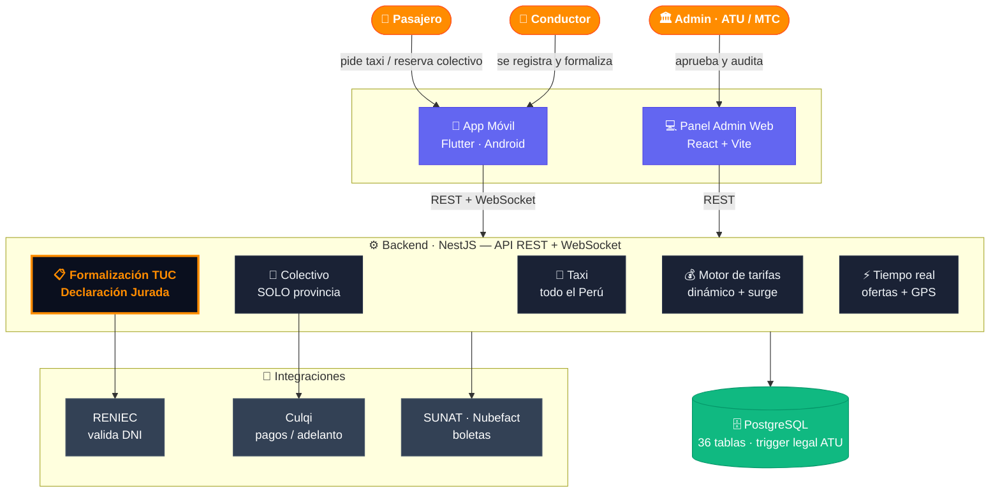
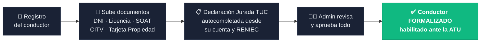
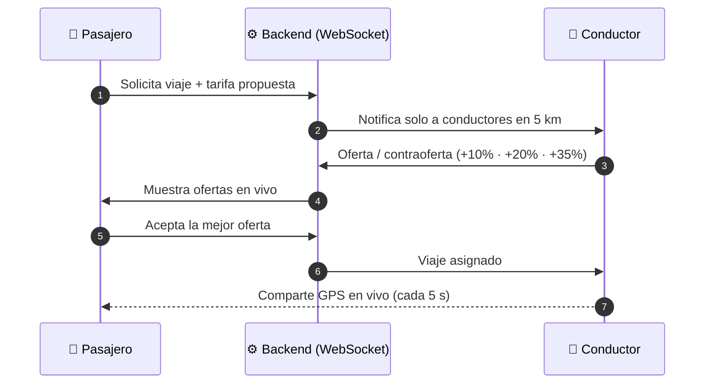
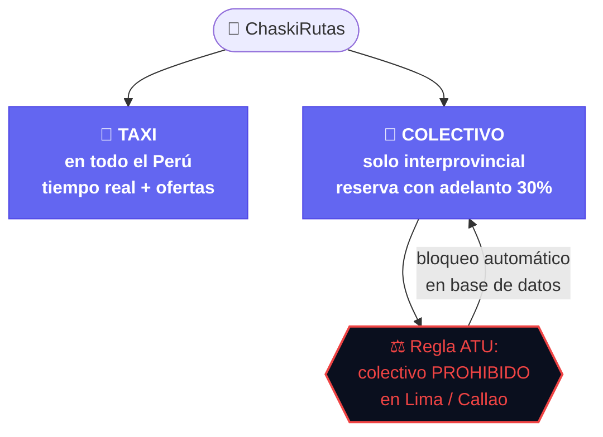

# 🎤 ChaskiRutas — Material para la presentación final

> **Tagline:** *Transporte formal para todo el Perú.*
> **Diferenciador (valor agregado):** al registrarte, la app **te formaliza**.

---

## 1) Diagrama principal — Arquitectura del ecosistema

---

## 2) Diagrama — El valor agregado: formalización asistida

---

## 3) Diagrama — Cómo funciona un viaje (tiempo real, tipo inDrive)

---

## 4) Diagrama — Dos servicios, una app (con la regla legal)

---

# 🗣️ Contexto para armar las diapositivas (guion de venta)

### El problema (slide 1–2)
- En Perú el transporte es **mayoritariamente informal**: taxis "piratas" y colectivos sin permiso.
- **Riesgo para el pasajero** (sin trazabilidad, sin seguro) y **para el Estado** (evasión, sin control ATU/MTC).
- Formalizarse es **caro y engorroso**: trámites TUC, ATU, SOAT, CITV, SUNAT… la mayoría de choferes no sabe cómo.

### La solución (slide 3)
- **ChaskiRutas**: una app tipo *inDrive* que conecta pasajeros y conductores, con **dos servicios**:
  - 🚕 **Taxi** — en **todo el Perú**, en tiempo real, con negociación de tarifa (ofertas).
  - 🚐 **Colectivo** — **solo interprovincial (provincia)**, con **reserva y adelanto del 30%** para no perjudicar a chofer ni pasajeros ante cancelaciones.

### ⭐ El valor agregado / diferenciador (slide 4 — el más importante)
- **Al registrarte, la app te formaliza.** No es solo un "Uber peruano": es la **puerta de entrada a la formalidad**.
- Gestiona tus documentos, **autocompleta la Declaración Jurada de la TUC** con tus datos y los de RENIEC, y te guía hasta quedar **habilitado ante la ATU**.
- **Nadie más resuelve esto.** Convertimos un trámite de semanas en un flujo de minutos dentro de la app.

### Cumplimiento legal como ventaja (slide 5)
- **Bloqueo automático** (a nivel de base de datos) de colectivos en **Lima/Callao**, donde la ATU los prohíbe → cumplimiento por diseño.
- **Panel de Auditoría B2G** para la ATU/MTC: trazabilidad, cumplimiento vehicular, demanda por ruta.
- **Boletas electrónicas SUNAT** automáticas al terminar el viaje.

### Cómo funciona (slide 6)
- Motor de tarifas **dinámico** (distancia, tiempo, hora punta/nocturno, categoría Estándar/Confort/XL).
- **Matching en tiempo real** por WebSocket: radio de 5 km, ofertas y contraofertas, GPS del conductor en el mapa.
- Comisión de plataforma del **15 %**; adelanto de **30 %** en colectivos.

### Qué ya está construido (slide 7 — credibilidad técnica)
- **App móvil** (Flutter) — pasajero y conductor en una sola APK, con Google Maps y tiempo real. ✅ corriendo
- **Backend** (NestJS + PostgreSQL) — API REST + WebSocket, 36 tablas, verificado end-to-end. ✅
- **Panel Admin Web** (React) — aprobación de conductores, KPIs y auditoría B2G. ✅
- **Integraciones**: RENIEC (validación de DNI real), Culqi (pagos), SUNAT/Nubefact (boletas).

### Modelo de negocio (slide 8)
- Comisión por viaje (15 %) · adelanto en colectivos · potencial: **servicio premium de formalización** y datos B2G para el Estado.

### Cierre (slide 9)
- *"ChaskiRutas no solo mueve personas: **formaliza el transporte del Perú**."*

---

## 🎨 Sugerencias de estilo para la diapositiva
- **Paleta de marca:** naranja `#FF8C00` (primario), índigo `#6366F1` (secundario), fondo azul oscuro `#0A0F1E`, verde `#10B981` (éxito).
- Usa el **Diagrama 1** como imagen central de la slide de arquitectura.
- Usa el **Diagrama 2** en la slide del valor agregado (resáltalo, es tu gancho).
- Mantén **poco texto** por slide: el diagrama manda, tú narras.
